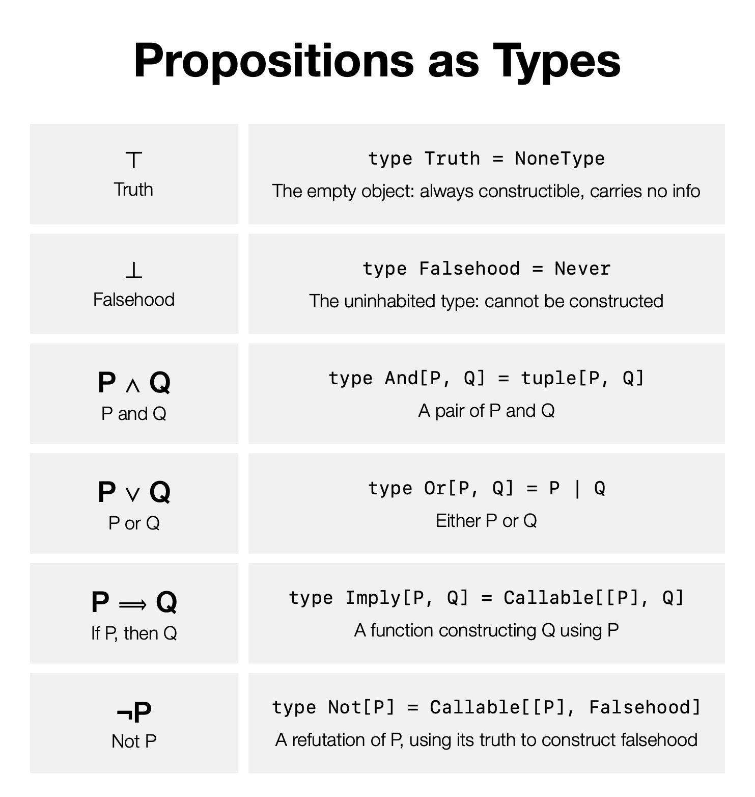
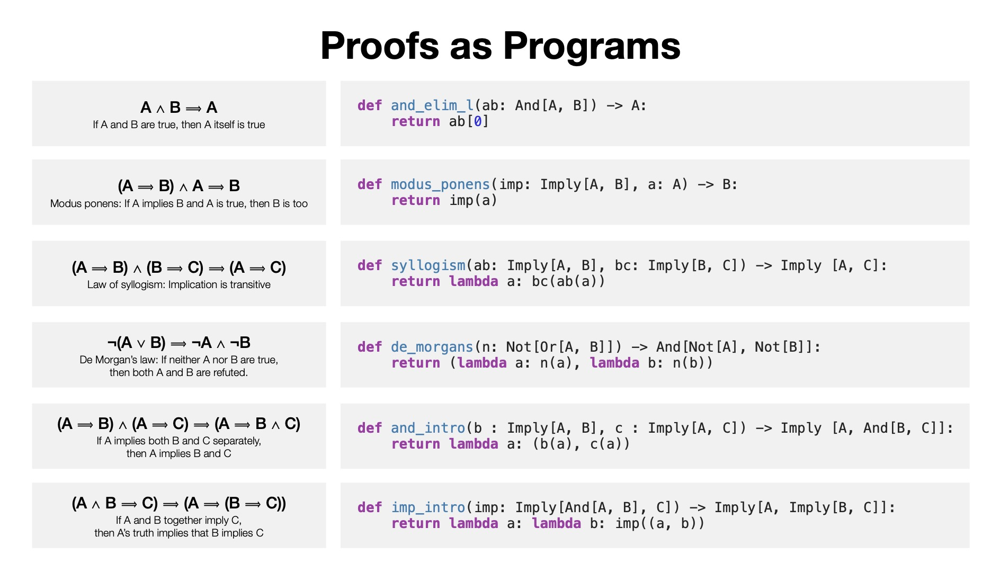

<!-- markdownlint-disable MD033 -->

## Introductory Reflection

Coming into ENGW 3315, I was searching for ways to strengthen the writing
skills that are most frequently exercised by academics, with an eye towards a
future career in academia. In particular, I originally wanted to practice
technical writing as well as pedagogical explanations. As the semester
continued, I realized that our online learning community was not necessarily
the most appropriate audience for my technical writings (this seemingly did not
stop me from trying :-P).

Around this time, I was working on a slide deck for a presentation that I was
giving at Northeastern's Software Day, as well as reflecting on some of the
previous talks that I have given. I recognized a common through line—the
presentations of mine that were the best received (covering both educational
and technical information) were those with an abundance of **visualizations**.

This realization came during a point in the semester where some of the
assignments in this class involved creating visual compositions. I was
inspired to pursue additional writings with visual components, and (in
hindsight) found this through line recurring in some of my favorite writings of
the semester.

The selective portfolio below showcases my evolving use of visuals across my
compositions throughout the semester. I have decided to organize my portfolio
as a website to easily embed various types of media, as well as include a new
data visualization recapping my experience interacting with the course (and our
online learning community as a whole). Along the way, I will use these visual
compositions to reflect on my broad experience with the course.

---

## Highlighting Extra

Maybe the extra or something?

### Analysis or something

Not sure if I actually want to have a subsection but I'll workshop.

Lorem ipsum dolor sit amet, consectetur adipiscing elit. Sed do eiusmod tempor
incididunt ut labore et dolore magna aliqua. Ut enim ad minim veniam, quis
nostrud exercitation ullamco laboris nisi ut aliquip ex ea commodo consequat.
Duis aute irure dolor in reprehenderit in voluptate velit esse cillum dolore eu
fugiat nulla pariatur.

---

## Responses

Two separate responses going in here probably

### Analysis

Lorem ipsum dolor sit amet, consectetur adipiscing elit. Sed do eiusmod tempor
incididunt ut labore et dolore magna aliqua. Ut enim ad minim veniam, quis
nostrud exercitation ullamco laboris nisi ut aliquip ex ea commodo consequat.
Duis aute irure dolor in reprehenderit in voluptate velit esse cillum dolore eu
fugiat nulla pariatur.

---

## Curry-Howard Infographic

{: .img-small}

### More commentary

Lorem ipsum dolor sit amet, consectetur adipiscing elit. Sed do eiusmod tempor
incididunt ut labore et dolore magna aliqua. Ut enim ad minim veniam, quis
nostrud exercitation ullamco laboris nisi ut aliquip ex ea commodo consequat.
Duis aute irure dolor in reprehenderit in voluptate velit esse cillum dolore eu
fugiat nulla pariatur.

---

## Writing timeline

<iframe src="assets/timeline.pdf" width="100%" style="aspect-ratio: 16/9; margin-bottom: 0.25rem;" frameborder="0"></iframe>

<iframe width="75%" height="300px" src="https://www.youtube.com/embed/crq0q88R-Uc" style="display: block; margin: 0 auto;" frameborder="0" allowfullscreen></iframe>

### Commentary

Lorem ipsum dolor sit amet, consectetur adipiscing elit. Sed do eiusmod tempor
incididunt ut labore et dolore magna aliqua. Ut enim ad minim veniam, quis
nostrud exercitation ullamco laboris nisi ut aliquip ex ea commodo consequat.
Duis aute irure dolor in reprehenderit in voluptate velit esse cillum dolore eu
fugiat nulla pariatur.

---

## Data visualization

  <button class="chart-toggle active" id="btn-weekly" onclick="setView('weekly')">Weekly</button>
  <button class="chart-toggle" id="btn-daily" onclick="setView('daily')">Daily</button>

<canvas id="timeChart"></canvas>

### Still not sure about sub-headings

Lorem ipsum dolor sit amet, consectetur adipiscing elit. Sed do eiusmod tempor
incididunt ut labore et dolore magna aliqua. Ut enim ad minim veniam, quis
nostrud exercitation ullamco laboris nisi ut aliquip ex ea commodo consequat.
Duis aute irure dolor in reprehenderit in voluptate velit esse cillum dolore eu
fugiat nulla pariatur.

---

## Conclusion / reflection

Lorem ipsum dolor sit amet, consectetur adipiscing elit. Sed do eiusmod tempor
incididunt ut labore et dolore magna aliqua. Ut enim ad minim veniam, quis
nostrud exercitation ullamco laboris nisi ut aliquip ex ea commodo consequat.
Duis aute irure dolor in reprehenderit in voluptate velit esse cillum dolore eu
fugiat nulla pariatur.
