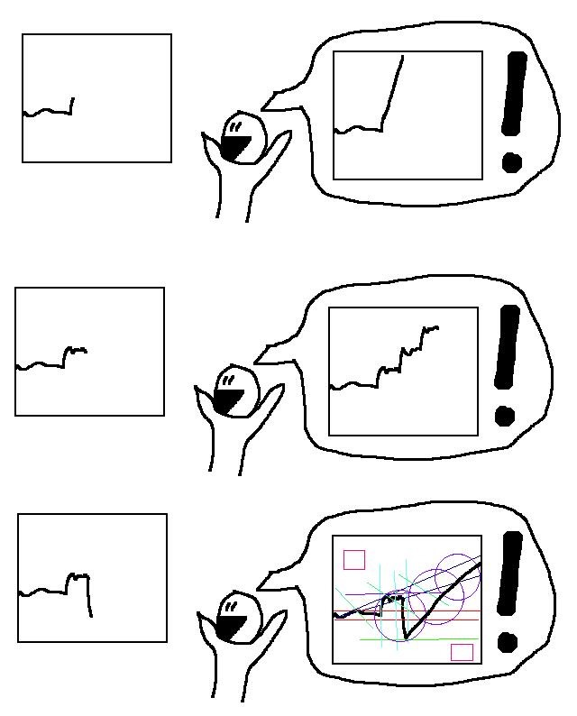

<!-- markdownlint-disable MD033 -->

## Introduction

Coming into ENGW 3315, I sought to strengthen the writing skills most
frequently exercised by academics, with an eye towards a (potential) future
career in academia. In particular, I hoped to practice both technical writing
and pedagogical explanation. As the semester continued, I realized that our
learning community was not always the most appropriate audience for my highly
technical work (though this didn't always stop me from trying :-P).

To lean into the educational side, I thought back on the various lectures and
presentations I have given during my time at Northeastern. I was able to
recognize a common through line—the talks of mine that were the best received
were (perhaps unsurprisingly) those with an abundance of **visualizations**.

This realization came at a point in the semester where this class's assignments
began calling for visual compositions. I was inspired to pursue additional
writings with visual components, and (in hindsight) found this through line
recurring across many of my favorite pieces from earlier in the semester.

The selective portfolio below showcases my evolving use of visuals throughout
this semester. I have organized it as a website to easily embed various media,
as well as to include a new (interactive!) data visualization recapping my
experience interacting with our online learning community. Along the way, I use
these visual compositions to reflect on my experience with the course as a
whole.

---

## Styling Textual Compositions


The majority of mathematics textbooks follow a "<mark
class="green">definition</mark>-<mark class="orange">theorem</mark>-<mark
class="yellow">proof</mark>"
structure, in which chapters consist of (cycles of) the following three phases:

1. <mark class="green">Definition</mark>: a new mathematical object is defined,
   and examples are given.
2. <mark class="orange">Theorem</mark>: a theorem (mathematical proposition)
   about that object is stated.
3. <mark class="yellow">Proof</mark>: the theorem is proved rigorously.

Often, there are many theorems and proofs about some newly defined mathematical
object before moving onto the next definition. Some of these mathematical
propositions are of lesser importance, perhaps only being proved to assist in
another proof; such propositions are called _lemmas_ (technically, lemmata),
rather than _theorems_.

Recently, I have observed parallels between this common structure of
mathematical writing and the structure I impose upon works as I actively read
them. Specifically, I use the following highlighting scheme:

1. Words and sentences highlighted in <mark class="green">green</mark> are
   newly defined words and their corresponding definitions.
2. Sentences highlighted in <mark class="orange">orange</mark> are the primary
   claims that the author makes.
3. Sentences highlighted in <mark class="yellow">yellow</mark> are most common,
   representing key details and examples that support the primary claims.

I have been using this highlighting scheme since high school; it seems that I
have been (subconsciously) reading like a mathematician for many years.

Now that I have drawn this connection, I am trying to consciously take
inspiration from the structure of mathematical writing to improve my
highlighting scheme. Specifically, I notice myself highlighting some minor
claims (lemmas) in <mark class="orange">orange</mark>, but others—those which I
(arbitrarily) deem less important—in <mark class="yellow">default
yellow</mark>. I am trying to use <mark class="purple">purple</mark> to
highlight these equivalents of lemmas, instead of implicitly promoting half of
them to the status of theorems.



This was one of my first "extra" writings of the semester, and (as far as I can
tell, after reviewing all of my posts) my first composition to utilize visual
components to make a more compelling case. Here, the subject matter of the
post—the highlighting scheme I use when marking up text—is inherently visual,
which is reflected by the styling of the post. Furthermore, the response is
about developing an analogy; the highlighting serves to visually demonstrate
that analogy, marking up corresponding aspects with the same color.

This response is one of my favorites of the semester, as it serves as an
example of a(n unrelated) insight gained by deeply engaging with the course
materials. I made this observation while reading carefully—both as a writer,
and as a mathematician—following the advice of Bunn.

Many of my other posts throughout the semester similarly use styling to
communicate effectively. In particular, I am quite fond of shoving tangential
comments and information into footnotes, as to avoid distracting readers on
their first go-through. I also have been careful to use blockquotes to style
quotations, in an attempt to clearly discern which ideas are my own and what
specifically I am responding to. External communications with fellow students
taking this course indicate that these styling choices have been (amusing and)
effective in increasing the readability of my compositions.

---

## Visualizations in Interactions



<mark class="purple">@Mia Yim</mark> I think this is a very reasonable and
nuanced take. I agree that LLM-generated images can act as a means by which
humans communicate emotions, thus serving as an artistic medium. The most
compelling example I can point to is [this
tweet](https://x.com/DonnelVillager/status/1741394747594318275), which uses an
AI generated image to (ironically enough) critique the use of AI for art.
Donnel, the original poster, uses AI to "complete" Keith Haring's [Unfinished
Painting](https://en.wikipedia.org/wiki/Unfinished_Painting)—a painting created
by Haring near his death, intentionally left incomplete to represent his life's
untimely end due to AIDS. While the completed image itself may not be
considered "artwork", I claim that the post as a whole does. In "completing"
the original work, its defining characteristic is wiped away, and the story it
tells alongside it. Donnel satirizes proponents of AI by imitating their
boisterous claims about AI's usefulness, and does so in a setting where the
soullessness of the AI-generated result is self-evident.



<blockquote class="twitter-tweet" data-theme="dark" data-dnt="true" align="center">
The story behind this painting is so sad! 😢 Now using AI we can complete what he couldn&#39;t finish! ❤️ <a href="https://t.co/RuASoTfFdk">https://t.co/RuASoTfFdk</a> <a href="https://t.co/uAwM6SBUGW">pic.twitter.com/uAwM6SBUGW</a>
&mdash; Donnel (@DonnelVillager) <a href="https://twitter.com/DonnelVillager/status/1741394747594318275?ref_src=twsrc%5Etfw">December 31, 2023</a></blockquote>

My favorite aspect of ENGW 3315 was reading and interacting with the posts made
by my peers each week. In particular, I appreciated being given opportunities
to  communicate back-and-forth with my peers in discussion threads. The comment
displayed above was drawn from the end of one of these threads, in which Mia
Yim and I were discussing the ethical implications surrounding "AI art".

While the comment above does not use visuals of my own, it is centered around a
work of art—specifically, one with many meta-level considerations about art as
a medium and the role humans play in making it. This post exemplifies some of
my opinions on LLM- and human-generated art (and visualizations in general) in
our increasingly (and disturbingly) AI-first world.

Putting visuals aside temporarily, this comment is archetypical of another
style of writing that this class allowed and encouraged me to engage in:
writing to _understand_. In most academic settings, I find myself writing to
_teach_, using text as a medium to communicate ideas that I have thought deeply
about. In contrast, writing this comment forced me to articulate some of the
nebulous thoughts I had about Donnel's work of art and "AI art" more broadly.
Since writing this post, I have found myself referring back to it, as it
effectively captures my ideas on a nuanced and confusing topic.

### A Visual Interaction


Hi Justin!

The amusing illustration you included reminded me of a similar comic, attached
below, which also demonstrates how one's (financial) preconceptions can impact
how they react to information. Have you ever found yourself (consciously or
subconsciously) in a similar position?

{: .img-small}



Both short and sweet, this comment illustrates my increasing comfort with using
visuals not just to accompany text, but as the primary contribution of the
composition itself. This comic is not my own, but one of my favorites. In this
post and in many others like it, I linked out to interesting visuals, blog
posts, and articles for my peers to interact with. Doing so (at least for me)
helped our virtual class feel more like a community, despite a lack of
face-to-face interaction.

---

## Primarily Visual, Yet Technical

The post above has an importance difference from those showcased before it; in
particular, it is a visual augmented by text, as opposed to text enhanced by
visuals. In this post, I exercised my ability to translate a textual response
into a more digestible, visual format. The juxtaposition of logical formulae
and program snippets highlights how the two languages can be translated
seamlessly between each other.

Despite this post being too technical in hindsight, it (as identified on the
midterm) was and continues to be one of the most interesting compositions of
this semester:
1. I had a clear and restrictive audience and rhetorical situation that I
   tailored my submission to, a learning goal of the course.
2. I was able to select a topic and audience that relates to my interests in
   computing and teaching.
3. I made some interesting technical observations about the limitations of
   union types for logical reasoning.

These are all skills and observations that I will be able to use moving
forward. At a meta level, I am satisfied with the fact that I was able to
identify that some of my posts were becoming too technically involved and
adjust accordingly for the remainder of the semester. In many situations—such
as when teaching—adjusting the level of rigor or pacing is important to avoid
confusing audiences.

---

## Visuals, Voluntarily

<iframe src="assets/timeline.pdf" width="100%" style="aspect-ratio: 16/9; margin-bottom: 0.25rem;" frameborder="0"></iframe>

<iframe width="75%" height="300px" src="https://www.youtube.com/embed/crq0q88R-Uc" style="display: block; margin: 1.5rem auto;" frameborder="0" allowfullscreen></iframe>

Taking yet another step further, I voluntarily decided to use a visual medium
when composing my "Writing Timeline". I chose to do so, as I enjoyed working on
the infographics above, and (as mentioned earlier) had just reflected on the
role that visuals play in clear academic communication. I think that this
decision strengthened my timeline, allowing readers to bounce back and forth
between selected excerpts and my commentary. In hindsight, perhaps a
slideshow/PDF was not the most effective visual medium; a website (like this
one!) could have been more convenient.

This assignment gave me the encouragement to finally dig through the large
collection of past writings that I have been (somewhat paranoidly) hoarding. I
thoroughly appreciated doing so, as it let me dig up a handful of lost
memories and reflect on my growth over the last ~10 years as a writer. The
timeline itself will serve as a useful collection of "greatest hits", allowing
me to reflect in the future without having to once again sift through gigabytes
of old data.

---

## Visualizing Engagement

One of my favorite creations from my time in high school, dug up while piecing
together the timeline above, was my visualization of my tracked time. Time
tracking is still one of my favorite habits, and one that lets me reflect on
things very quantitatively (which I do in weekly "time tracking reviews").

I wanted to conclude this reflection by creating a new visual to capturing these
quantitative insights:

  <button class="chart-toggle active" id="btn-weekly" onclick="setView('weekly')">Weekly</button>
  <button class="chart-toggle" id="btn-daily" onclick="setView('daily')">Daily</button>

  Hours
  Post
  Comment
  Extra

  

  

    <canvas id="timeChart"></canvas>
  

  

  Time spent on ENGW 3315 each week, alongside categorized course contributions.
  Hover over any bar to see a breakdown by assignment, and toggle between weekly and daily views.
  The "Daily" view requires horizontal scrolling.
  Tracked time may not be entirely accurate, and contributions were categorized manually.

Some notable observations:
- Unsurprisingly, the majority of my contributions came in the form of
  comments. As discussed earlier, interacting with my peers was my favorite
  part of this course; it is no wonder I spent the most time doing so.
- The most time I spent in one week on an assignment was for the "Writing
  Social Justice" assignment. Here, I was certainly writing to understand,
  rather than writing to teach. I spent much of this time reading and
  re-reading excerpts from the literature on critical pedagogy.
- Despite a relatively consistent distribution of time spent at the weekly
  scale, looking at individual days shows that much of my contributions were
  concentrated in "spiky" working sessions. This makes sense, given the
  (unfortunately packed) structure of my schedule this semester.

---

Thank you, Ellen, for a wonderful semester. And thank you to anyone who has
read this far! This course has consistently been a much-needed reprieve from
rest of these last few, dense months.
